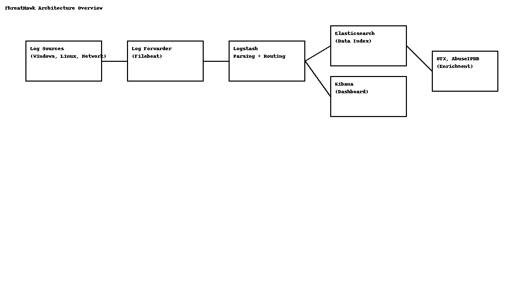
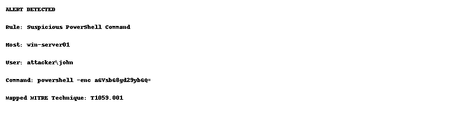
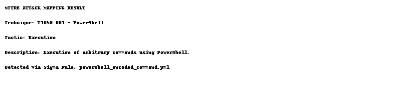

# ThreatHawk

**ThreatHawk** is a real-time intrusion detection and threat correlation system. It simulates a small-scale Security Operations Center (SOC) and provides actionable threat visibility by leveraging log aggregation, MITRE ATT&CK mapping, and threat intelligence enrichment.

---

## 🧰 Features

- Log ingestion from Linux, Windows, and network devices
- Real-time alerting using Sigma rules
- Threat enrichment via OTX and AbuseIPDB
- Visualization using Kibana dashboards
- Mapping to MITRE ATT&CK techniques
- Basic incident response reporting

---

## 🔧 Architecture Overview



---

## 🚀 Setup Instructions

### 1. Prerequisites

- Docker & Docker Compose
- Python 3.8+
- Git

### 2. Clone and Build the Project

```bash
git clone https://github.com/your-username/ThreatHawk.git
cd ThreatHawk
```

### 3. Start ELK Stack

```bash
docker-compose up -d
```

### 4. Start Ingesting Logs

```bash
filebeat -e -c log_collection/filebeat-config/filebeat.yml
```

### 5. Enrich Logs with Threat Intel

```bash
python3 threat_intel/otx_lookup.py --input logs.json --output enriched_logs.json
```

### 6. Map Alerts to MITRE ATT&CK

```bash
python3 mitre_mapping/tactic_technique_mapper.py enriched_logs.json
```

---

## 📊 Screenshots

### ⚠️ Alert Example



### 🎯 MITRE ATT&CK Mapping



---

## 📂 Project Structure

```
threathawk/
├── log_collection/
│   ├── filebeat-config/
│   └── event-forwarder/
├── log_parsing/
│   └── logstash-pipelines/
├── detection_rules/
│   └── sigma-rules/
├── threat_intel/
│   └── otx_lookup.py
├── dashboards/
│   └── kibana-visualizations.json
├── mitre_mapping/
│   └── tactic_technique_mapper.py
├── docs/
│   └── incident_report_template.md
├── README.md
```

---

## 📘 License

MIT License
